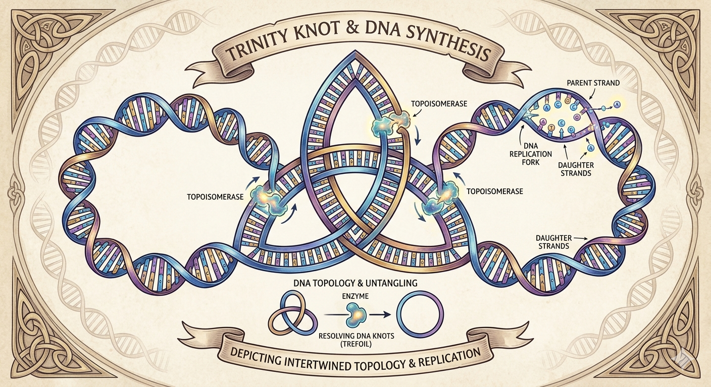

= The Trinity Knot and DNA Synthesis
:toc: left
:toclevels: 2
:sectnums:

== Introduction to the Analogy

The Trinity knot, also known as a *triquetra*, is a traditional Celtic symbol representing three interconnected, indivisible parts. While not a direct biological term, its structure serves as an excellent visual and conceptual analogy to explain the complex, tangled structures that DNA forms during replication, as well as the topological "knotted" shapes studied in molecular biology.

== How the Trinity Knot Relates to DNA Synthesis

=== Representing Interconnectedness (Replication)
During DNA replication, the double helix unravels and separates into two new strands. Due to the high-density packing within the cell, these newly synthesized daughter molecules often become linked or tangled with each other in complex, knotted, or closed loops. 

The knot-like structure in the triquetra represents the intertwined, complex "three-strand" state (the two new strands + the parent strand) that cells must resolve to function correctly.

=== The Trefoil Knot Analogy
Mathematically, the Trinity knot is a form of a *trefoil knot* (or a 3-crossing torus knot). 

Knot theory—a specialized branch of mathematics—is used by molecular biologists to model how enzymes called *topoisomerases* cut and pass DNA strands through one another to untangle them during and after synthesis.

=== DNA Synthesis as Topological Manipulation
The act of synthesizing or replicating DNA involves creating "supercoils," where the DNA twists around itself in knots to accommodate the separation of the strands. The Trinity knot symbolizes the topological challenge of separating two closed DNA circles that have been created during synthesis.

=== Structure Modeling
Scientists utilize 2D diagrams of complex knots, such as the Trinity knot, to calculate the minimum number of actions a topoisomerase enzyme needs to untangle a knotted DNA loop back into its functional, circular, or linear form.

== Conceptual Diagram

An artful graphic depicting this relationship features:
* A central, stylized **Trinity Knot** woven entirely out of a colorful DNA double helix.
* **Topoisomerase enzymes** actively binding to and untangling the overlapping strands.
* A **DNA replication fork** detailing the split between the parent strand and emerging daughter strands.
* An instructional breakdown illustrating how enzymes resolve **trefoil knots** into clean, functional DNA rings.

== Academic and Foundational References

The primary scientific field connecting the Trinity knot (mathematically classified as a trefoil knot) to DNA synthesis is **DNA Topology**. The key references establishing this relationship include:

=== 1. Key Papers on DNA Knotting and Topoisomerases

*Discovery of DNA Knotting Mechanisms*::
* *Reference:* Brown, P. O., & Cozzarelli, N. R. (1979). "A sign of the times: A topological approach to the mechanism of DNA topoisomerases."
* *Details:* This foundational research first introduced the use of knot theory to understand how topoisomerases cut, untangle, and re-join DNA strands during synthesis.

*Chirality and Trefoil Formations*::
* *Reference:* Crisona, N. J., Weinberg, R. L., Peter, B. J., Sumners, D. W., & Cozzarelli, N. R. (1997). "Chirality of DNA trefoils: Implications in intramolecular reconnection." _Proceedings of the National Academy of Sciences (PNAS)_.
* *Details:* This paper analyzes the exact mathematical structure of the "trefoil knot" as it physically manifests in knotted DNA rings during replication processes.

*Enzymatic Modulation of Knotted DNA*::
* *Reference:* Martinez-Garcia, B., et al. (2019). "Transcriptional supercoiling boosts topoisomerase II-mediated DNA knotting." _PMC Nucleic Acids Research_.
* *Details:* Outlines how Type II topoisomerases produce and remove trefoil knots to alleviate the extreme structural strain built up during transcription and replication.

=== 2. General DNA Topology and Mathematical Knot Books

*The Intersection of Math & Molecular Biology*::
* *Reference:* Adams, C. (1994/2004). _The Knot Book: An Elementary Introduction to the Mathematical Theory of Knots_. American Mathematical Society.
* *Details:* This standard textbook dedicates chapters specifically to biological knots, explaining how molecular biologists use mathematical knot classifications to map out the geometric constraints of DNA and polymer chains.

*Enzyme Actions Viewed through Topology*::
* *Reference:* Sumners, D. W. L. (1995). "Lifting the Curtain: Using Topology to Probe the Hidden Action of Enzymes." _American Mathematical Monthly_.
* *Details:* Discusses how the spatial transitions of a molecule from an unknotted circle to a trefoil or other complex links provide direct, measurable clues regarding the behavior of replication enzymes.

=== 3. Institutional Overviews

*National Institute for Mathematical and Biological Synthesis (NIMBioS)*::
Details how measuring changes in crossing numbers helps researchers map the termination of DNA replication via knot theory.

*Society for Industrial and Applied Mathematics (SIAM)*::
Publishes extensive analyses on how DNA simplifies its topology to reduce tension, using the trefoil knot as the baseline metric for complex strand crossings.
